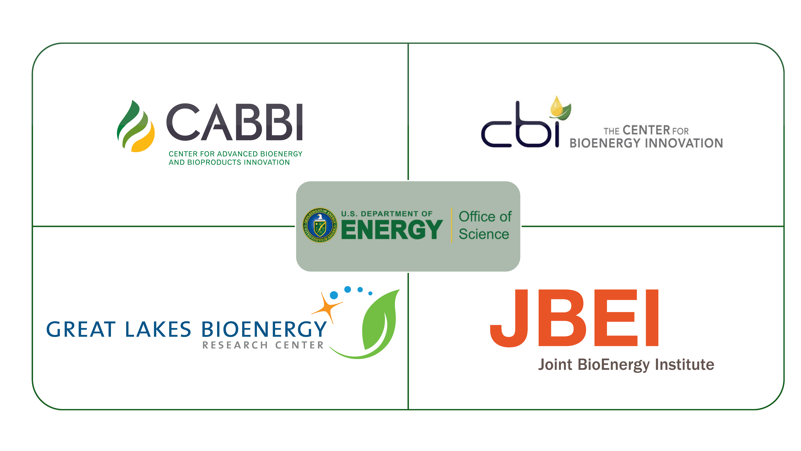

This is the homepage for the Department of Energy Inter-BRC Microbiome Workshop held in Ames, IA on September 9 - 10. This workshop is being organized by the Microbiome Shared Research Objective leads from the four BRCs: Adina Howe (CABBI), Melissa Cregger (CBI), Tomas Rush (CBI), Sarah Lebeis (GLBRC), Henrik Scheller (JBEI), and Yen Ning Chai (JBEI). It is hosted by the GERMS lab at Iowa State University.

### Workshop goal: Enable shared access and interactions with plant microbiome data across BRCs.
* Communication of plant microbe objectives across BRCs
* Update of BRC scientists on development of plant microbial shared research resources
* Training on plant microbiome dataset management
* Training on identification of core microbiome between BRC datasets (Goal is to have each BRC feedstock represented and identification of core taxa)

